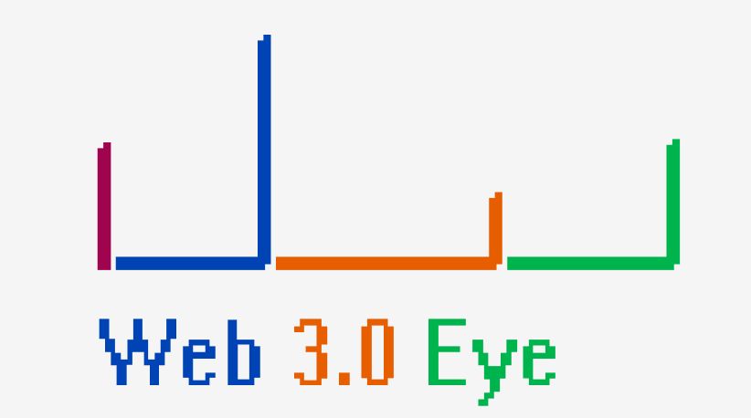
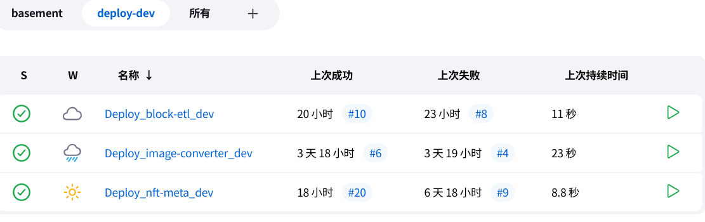
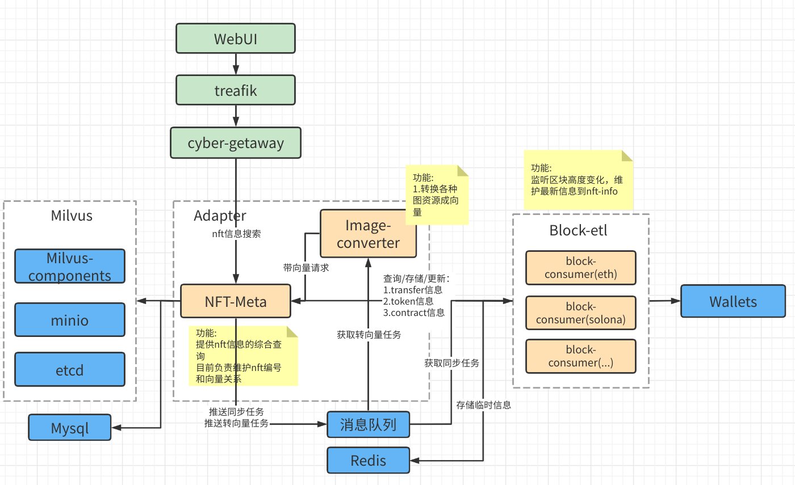
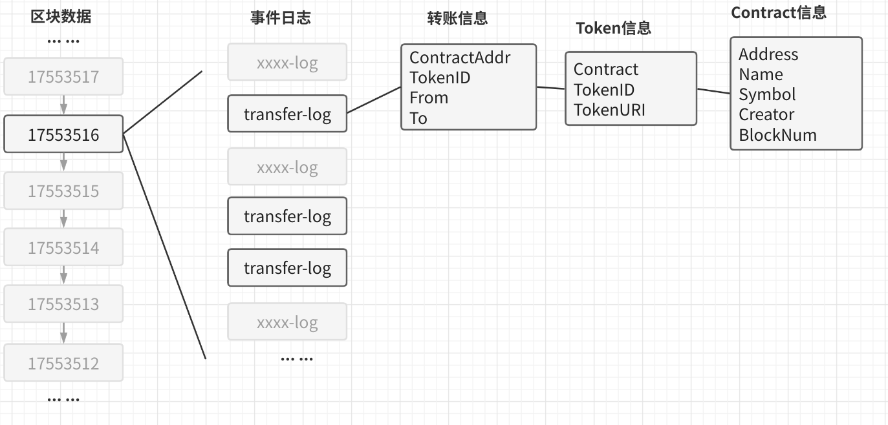
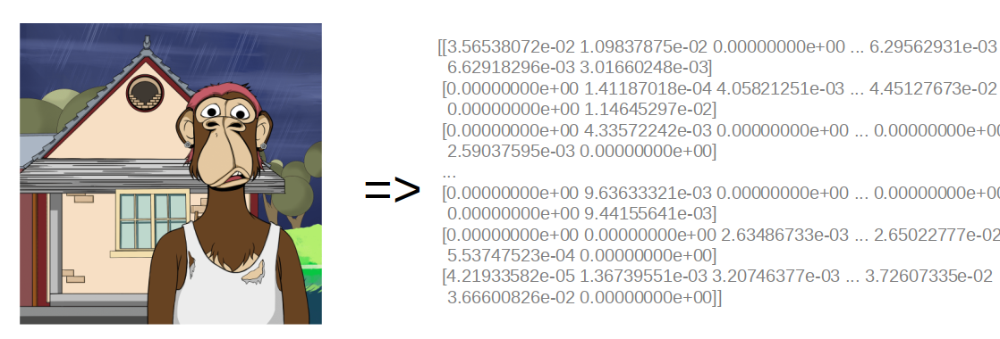
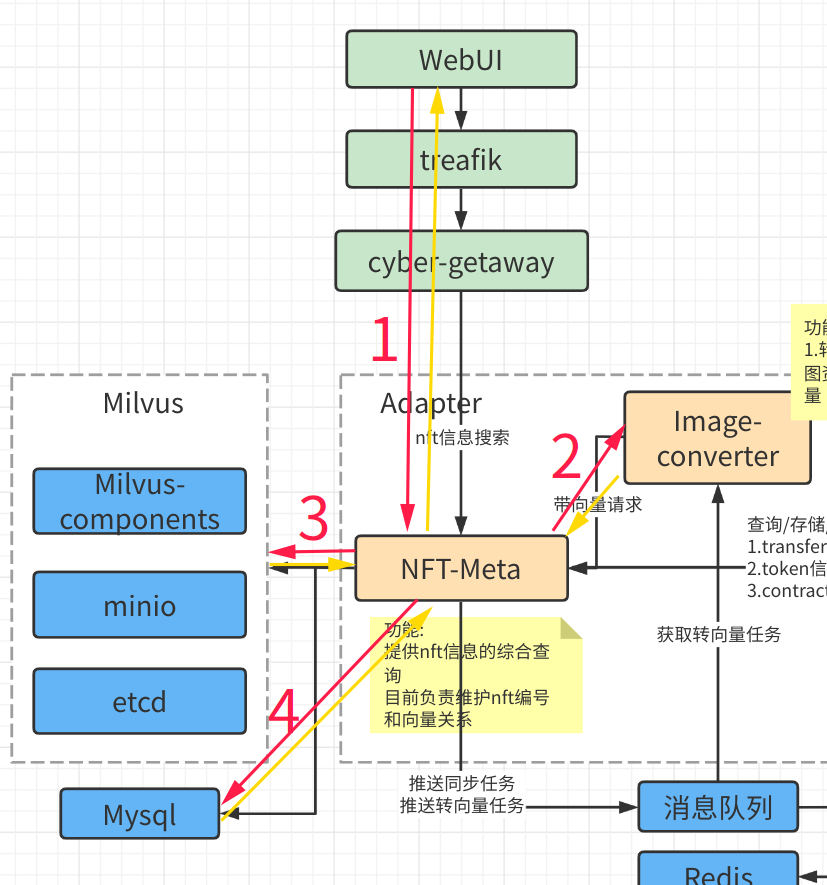
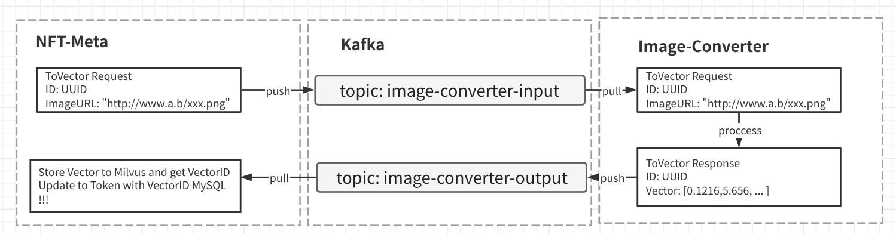
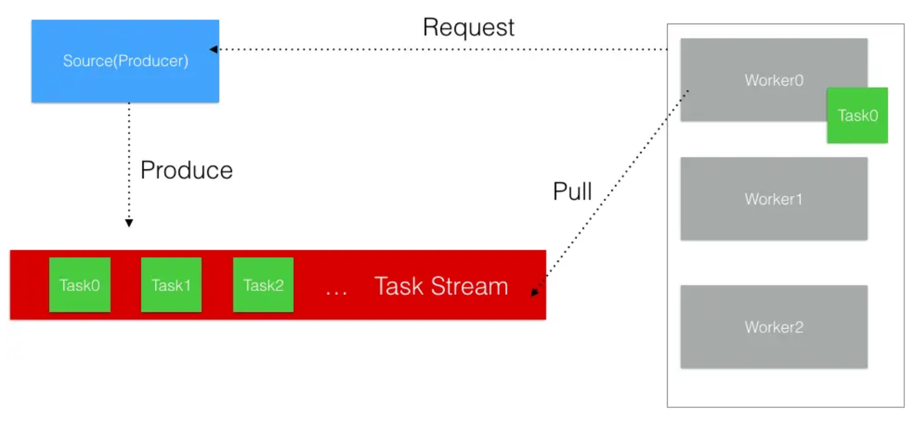

# Web3Eye

[](https://github.com/web3eye-io/Web3Eye/actions/workflows/main.yml)



目前在NFT的世界中很多关于区块链的信息索取方法复杂且用户难以上手，让大众很难获取信息；

再者目前的各种区块链项目数据是割裂状态 ，获取或整理信息就变得更难了；

Web3Eye是一个聚合历史NFT交易记录的搜素引擎；

可以提供NFT资产的多链聚合搜索。

## Quick start

机器最低配置及规模:

主机硬件最小配置：CPU-8核 内存-16G 存储-100G， 三台linux服务器组成k8s集群；

本次测试使用3台主机：IP分配如下

| IP           | 硬件配置                       | 角色              |
| ------------ | ------------------------------ | ----------------- |
| 172.23.10.31 | CPU:8核  内存：16G  磁盘：100G | master,nfs-client |
| 172.23.10.32 | CPU:8核  内存：16G  磁盘：100G | node32,nfs-client |
| 172.23.10.33 | CPU:8核  内存：16G  磁盘：160G | node33,nfs-server |

以上仅为测试配置，正式环境需要搜集数据后进行评估。

### 1 安装docker和kubernetes

#### 安装

安装Docker到Linux服务器，本教程使用Docker版本为20.10.16。安装完成后请检查docker版本，很多linux发行版直接安装的docker版本过低。

在3台机器上安装K8s集群，可选择kubeasz快速安装(项目链接:<https://github.com/easzlab/kubeasz>)。

安装完成后把/etc/kubeasz/bin添加到PATH环境变量。

还需要在Master节点安装Helm(安装介绍<https://helm.sh/docs/intro/install/>)。

#### 配置nfs为默认存储类

本示例使用NFS作为存储类，也可以替换成其他存储方案。

在k8s集群中的每一台服务器上安装nfs客户端。

首先选择一台主机安装nfs-server并配置一个路径提供NFS服务。

在k8s集群的master机器上把web3eye-io/Web3Eye项目clone到服务器并配置NFS。

```shell
git clone https://github.com/web3eye-io/Web3Eye.git
cd Web3Eye/basement
cat 02-nfs-storage/value.yaml
```

主要关注server和path，修改成NFS服务的地址和路径即可

```yaml
nfs:
  server: 172.23.10.83
  path: /data/k8s_storage
```

确认好配置后执行install.sh

```shell
bash install.sh
```

脚本运行完毕后须看到以下输出结果：

```shell
root@k8s-master:~/Web3Eye/basement/02-nfs-storage# kubectl get pods  -o wide  | egrep nfs 
default-nfs-provisioner-nfs-subdir-external-provisioner-7fx2pwz   1/1     Running     6 (5h21m ago)   19h     172.20.144.99    172.23.10.33   <none>           <none>
```

### 2 安装Jenkins及配置Jenkins环境

#### 使用docker直接起一个jenkins

需要按照实际情况配置端口映射关系以及文件映射关系，这里需要明确好docker.sock和.kube配置的路径。

这里需要注意.kube中的kube-apiserver要指向的docker能访问的IP不能指向127.0.0.1

示例如下：

```shell
root@k8s-master:~/.kube# cat config
apiVersion: v1
clusters:
- cluster:
    certificate-authority-data: LS0tLS1CRUdJTiBDRVJUSUZJQ0FURS0tLS0tCk1JSURsRENDQW55Z0F3SUJBZ0lVRXFXVjZHQ2JkWVZHMWhsVmRZYkhyMTRpcnNrd0RRWUpLb1pJaHZjTkFRRUwKQlFBd1lURUxNQWtHQTFVRUJoTUNRMDR4RVRBUEJnTlZCQWdUQ0VoaGJtZGFhRzkxTVFzd0NRWURWUVFIRXdKWQpVekVNTUFvR0ExVUVDaE1EYXpoek1ROHdEUVlEVlFRTEV3WlRlWE4wWlcweEV6QVJCZ05WQkFNVENtdDFZbVZ5CmJtVjBaWE13SUJjTk1qTXdNVEV3TVRBek9EQXdXaGdQTWpFeU1qRXlNVGN4TURNNE1EQmFNR0V4Q3pBSkJnTlYKQkFZVEFrTk9NUkV3RHdZRFZRUUlFd2hJWVc1bldtaHZkVEVMTUFrR0ExVUVCeE1DV0ZNeEREQUtCZ05WQkFvVApBMnM0Y3pFUE1BMEdBMVVFQ3hNR1UzbHpkR1Z0TVJNd0VRWURWUVFERXdwcmRXSmxjbTVsZEdWek1JSUJJakFOCkJna3Foa2lHOXcwQkFRRUZBQU9DQVE4QU1JSUJDZ0tDQVFFQTA1MHFDN0hYZzZGQWFKN3Z1ZUJvQlRENEN5aU8KSjJiYitUZ2V3NDN6ekNtRmdSZ1ZUdmxsejJjd0cxWGNCdnBTMzlsdEd3TGRUSEhGNHBuNFhVOTlnKzJGaEhqbgpMZDE5UzZXZFBMRk5PLy9maU0vNGx2enYzN21zUFhhQVNZTHRidjQwV0xuSmYwTDhzeUxSV1VkMkp3Nm1VMTVWCjVEeEU1RG9WYS9Ib3lGSlhnc0xrc0hJQmt0T1QxM0FUZ09nL1V3STdGcGt4aXFhelYzUjBUNU5WcXEzaW1JS20KYlFaYUNVdFdtRHVXTk5uOGJ2Vno0U21vb0N4ejUybDVUdEZXN0E4SzRKK0JXRDhYcFV1dkIvRy9IZVhESFpQKwpIeVJSTDZNemVLYVAwaVNSOVlIbUwyZklZc0hrb0ozcHhJWXFjcStvR2pGUzVaZUZRa01kVS9EU2xRSURBUUFCCm8wSXdRREFPQmdOVkhROEJBZjhFQkFNQ0FRWXdEd1lEVlIwVEFRSC9CQVV3QXdFQi96QWRCZ05WSFE0RUZnUVUKaU9yeUUzWXlqdFhFY3JYNDZnS0V2OENYVTZRd0RRWUpLb1pJaHZjTkFRRUxCUUFEZ2dFQkFGaDBlb0N4d2VaTQpzang2b0FXR280Z0JNSEpxbW43YmUybENmc21CMjJBYndsRWVpWjJRWkJ4WWRERHJGTXNHc1Z3RjVxNjZiT3QxCm5xWjBTVS9CY0dISGFnTU9vWmwxRzVyRVJFempoeUJpNWsrajZ2NG5LTWxnSXdoaWw0Qzg5UUhyM0I3QkhYVEMKQTd1dCt1YVYxenVFVitsZGEvYVJGTllOVGZ0d0dSdDFQeWMvL2dVVm50QzlabU9ISHlPU280a1ZiMFNKVk5mZgpNTEdBWGJGdEp5ekc0OUtjVDBQWFVvNjZhTTlCMHZZYWZzTWs1OTR5OGhsRmJiUnJ5elpFTENNZFo4czRtQ2J6CnFJbDFoV01DUXcxL1Y2bVN3WXhOWG8xSy9QcjVVdXBLVUxLUFNPdTZFc0d5aDA2aEJpR0daT3dvQ3JSM2dIYnAKK0Zyc3d1ekpuL1E9Ci0tLS0tRU5EIENFUlRJRklDQVRFLS0tLS0K
    server: https://172.23.10.31:6443
  name: cluster1
```

运行jenkins容器

```shell
docker run \
  -u 0\
  --name jenkins \
  -d \
  --privileged \
  -p 18080:8080 \
  -p 50000:50000 \
  -v /opt/share/jenkins:/var/lib/jenkins   \
  -v /sys/fs/cgroup:/sys/fs/cgroup:ro      \
  --tmpfs /tmp:exec --tmpfs /run --tmpfs /run/lock --tmpfs /var/run \
  -v /var/run/docker.sock:/var/run/docker.sock  \
  -v /root/.kube:/root/.kube  \
  coastlinesss/jenkins
```

#### 获取 jenkins初始密码

```shell
docker exec -it jenkins cat /var/jenkins_home/secrets/initialAdminPassword
```

访问jenkins web页面(172.23.10.31:18080)，完成Jenkins初始配置，如添加用户等，在安装插件时可先安装建议插件。

#### 配置Jenkins环境

**安装Git插件**（Dashboard > 系统管理 > 插件管理 > Available plugins > 搜索Git并安装）

**配置Git** 接受第一次连接（Dashboard > 系统管理 > 全局安全配置 ），找到Git Host Key Verification Configuration选择Accept first connection

**配置Git名称** 接受第一次连接（Dashboard > 系统管理 > 全局工具配置 ），找到Git 配置Path to Git executable 为git

**安装Go插件**（Dashboard > 系统管理 > 插件管理 > Available plugins > 搜索Go并安装）

**配置Go插件**（Dashboard > 系统管理 > 全局工具配置 > 找到Go）,设置别名为go, 安装一个Go 1.17

### 3 安装依赖组件

#### 新建安装任务

新建安装组件的任务（即job）

创建item: install_components

选择Pipeline类型

**勾选GitHub项目：**  
    项目URL：<https://github.com/web3eye-io/Web3Eye.git/>  

**勾选This project is parameterized：**  
    增加三个字符参数分别为：  
        名称：INSTALL 默认值：true  
        名称：UNINSTALL 默认值：false  
        名称：TARGET 默认值：all  

流水线中选择Pileline script from SCM  
    SCM:Git  
        Repositories:  
            Repository URL: <https://github.com/web3eye-io/Web3Eye.git/>  
            Credentials: 配置一个Git的凭证，可选择SSH Username with private key或Username with password  
        Branches to build:  
            指定分支：*/master  
    脚本路径：basement/Jenkinsfile  

选择保存

新建视图basement，选择列表视图(install_components)。

#### 执行安装任务

Dashboard > basement > install_components

选择**Build with Parameters**,点击 **开始构建**

观察构建过程，全部完成后组件就安装成功了

登录机器查看安装成功的组件

```shell
root@k8s-master:/home/test# kubectl get pod
NAME                                                              READY   STATUS      RESTARTS        AGE
default-nfs-provisioner-nfs-subdir-external-provisioner-57czz2m   1/1     Running     0               4d17h
development-box-0                                                 1/1     Running     0               17h
kafka-0                                                           1/1     Running     0               3d22h
kafka-1                                                           1/1     Running     0               3d22h
kafka-2                                                           0/1     Pending     0               3d22h
kafka-zookeeper-0                                                 1/1     Running     0               3d22h
kafka-zookeeper-1                                                 1/1     Running     0               3d22h
kafka-zookeeper-2                                                 1/1     Running     0               3d22h
milvus-datacoord-5f7b497444-28k8m                                 1/1     Running     2 (3d18h ago)   3d23h
milvus-datanode-684c8d4986-gnpzs                                  1/1     Running     2 (3d18h ago)   3d23h
milvus-etcd-0                                                     1/1     Running     1 (3d18h ago)   3d23h
milvus-etcd-1                                                     1/1     Running     3 (3d18h ago)   3d23h
milvus-etcd-2                                                     1/1     Running     1 (3d18h ago)   3d23h
milvus-indexcoord-7df986464d-sqlzq                                1/1     Running     2 (3d18h ago)   3d23h
milvus-indexnode-6b6c7f7797-mpxss                                 1/1     Running     1 (3d18h ago)   3d23h
milvus-minio-0                                                    1/1     Running     0               3d23h
milvus-minio-1                                                    1/1     Running     0               3d23h
milvus-minio-2                                                    1/1     Running     0               3d23h
milvus-minio-3                                                    1/1     Running     0               3d23h
milvus-proxy-645fbb45f4-ntw94                                     1/1     Running     2 (3d18h ago)   3d23h
milvus-pulsar-bookie-0                                            1/1     Running     0               3d23h
milvus-pulsar-bookie-1                                            1/1     Running     0               3d23h
milvus-pulsar-bookie-2                                            1/1     Running     0               3d23h
milvus-pulsar-bookie-init-jsjbf                                   0/1     Completed   0               3d23h
milvus-pulsar-broker-0                                            1/1     Running     1 (3d18h ago)   3d23h
milvus-pulsar-proxy-0                                             1/1     Running     0               3d23h
milvus-pulsar-pulsar-init-v9bfg                                   0/1     Completed   0               3d23h
milvus-pulsar-recovery-0                                          1/1     Running     0               3d23h
milvus-pulsar-zookeeper-0                                         1/1     Running     0               3d23h
milvus-pulsar-zookeeper-1                                         1/1     Running     0               3d23h
milvus-pulsar-zookeeper-2                                         1/1     Running     0               3d23h
milvus-querycoord-6778454959-v6zks                                1/1     Running     2 (3d18h ago)   3d23h
milvus-querynode-569c9db6ff-w2968                                 1/1     Running     1 (3d18h ago)   3d23h
milvus-rootcoord-57c9dbfcd9-whttz                                 1/1     Running     2 (3d18h ago)   3d23h
mysql-0                                                           1/1     Running     0               3d23h
redis-cluster-0                                                   1/1     Running     1 (12h ago)     12h
redis-cluster-1                                                   1/1     Running     1 (12h ago)     12h
redis-cluster-2                                                   1/1     Running     1 (12h ago)     12h
redis-cluster-3                                                   1/1     Running     1 (12h ago)     12h
redis-cluster-4                                                   1/1     Running     1 (12h ago)     12h
redis-cluster-5                                                   1/1     Running     1 (12h ago)     12h
traefik-4f9vc                                                     1/1     Running     0               3d23h
traefik-9fxc4                                                     1/1     Running     0               3d23h
traefik-9lxvl                                                     1/1     Running     0               3d23h
whoami-58b8d4f6f6-cklq5                                           1/1     Running     0               3d23h
whoami-58b8d4f6f6-sh2cc                                           1/1     Running     0               3d23h
```

### 4 部署项目

#### 创建视图和任务

新建deploy-dev视图，新建部署项目的任务

参考 安装依赖组件 中的新建任务(可直接克隆)，除了参数化构建过程中的参数不一样以及最后一步SCM中的脚本路径为Jenkinsfile外，其他配置都一致。

参数化构建过程中的Jenkinsfile任务参数矩阵，选择[项目构建&部署任务](#001)中的d-dev取值，根据AIMPROJECT的三个取值创建成三个不同的部署任务。



#### 部署项目

依次参数化构建，建议部署顺序：nft-meta、block-etl、image-converter

构建完成后访问k8s-master-IP:80/api/nft-meta/可访问项目测试页面

## 架构

中间件：  
**MySql** 存储任务信息、NFT数据关系  
**Kafka** 主要用于任务分配  
**Redis** 用于缓存从MySql查到的热信息(计算机中的局部原理，减轻MySql的压力)  
**Milvus** 用于存储向量数据，以及提供向量搜索  

微服务模块：  
**NFT-Meta** 维护区块转储任务,存储NFT交易、NFT资产、NFT对应Contract等信息  
**Block-ETL** 负责与区块链节点交互，获取NFT的transfer日志，分析对应的Token信息以及Cantract信息  
**Image-Converter** 将图片转换为向量  



在主要的三个微服务模块中，NFT-Meta负责提供搜索、信息存储查询、任务分发等功能，其他两个模块更多的是获取并处理任务；其中Image-Converter不只是处理从Kafka获取由NFT-Meta发送的任务，还提供HTTP服务支持直接请求获得向量，主要用来为以图搜图服务；而Block-ETL不对外提供接口，只接收任务和提交任务。

### 模块设计

#### Image-Converter

目前主要提供Jpg、Jepg、Png等常规图片格式的转向量操作，其他图像资源比如GIF、Base64等目前并不支持。  
服务启动后有两个线程，一个负责提供HTTP接口方式的转向量方式，提供同步的转向量方式，支持URL和文件两种方式；还有一个负责从Kafka获取转向量任务，转换后放入Kafka中NFT-Meta获取后存入Milvus和数据库。  

#### Block-ETL

目前仅支持Ethereum，所以以下描述都基于ETH背景；并且目前也只支持标准的ERC721和ERC1155至于其他玩法的NFT后续提供支持。

从区块链全节点（存有全部区块数据，下面称为钱包节点）中的log中**拉取transfer信息，解析出NFT交易、Token、Contract信息**；由于存在Swap合约、非标准NFT合约所以部分Token信息无法解析出资产信息（比如图片描述和图片地址）。

从NFT-Meta获取的任务粒度为区块高度，从一个区块高度中获取所有的transfer-log，记录每一笔transfer；再从transfer信息查找Token信息，因为多笔transfer可能会对应到同一个Token，所以会先向数据库查询Token是否存在，不存在会向钱包节点请求TokenURI同时也会检查对应的Contract是否存在。在此处查询Token和Contract是否存在时，其实会先检查Redis里是否有记录，没有记录再去数据库查询，当查询到后会在Redis中建立一条记录。



在解析一个区块的transfer日志时，大部分信息都可以从钱包节点获取。但是从TokenURI中所带的信息需要从互联网或者IPFS上获取，或者直接在区块链上存储Base64、SVG等，解析TokenURI的工作目前还属于这个模块，后续考虑独立成一个单独的模块。因为这样的解析工作费时费力，同时尽量保持Block-ETL只与钱包节点交互、只做链上数据的转存工作。

#### NFT-Meta

分配到其他两个模块的任务都由NFT-Meta发出、存储其他两个模块处理过的数据并对外提供搜索功能。目前这个模块可能有些臃肿，比如关于搜索的功能可以独立出去、其他模块产生的数据直接与数据库交互这类问题后续会继续思考，但是前期搜索由于功能较少先放到这个模块中。

NFT-Meta主要维护四个表：  
1 **Transfers**  NFT交易记录  
2 **Tokens**  NFT-资产信息  
3 **Contracts**  NFT-合约信息  
4 **SyncTasks**  同步任务

NFT-Meta提供GRPC和HTTP两种协议的API接口，GRPC主要提供给对内的微服务模块，HTTP对外提供服务；向量数据主要存在Milvus中，关系型数据主要存在MySql中。Milvus与MySql中的数据依靠Milvus提供的ID关联。  
Milvus中结构为：

{  
    ID: 13125  
    Vector: [0.234,2.923,...]  
}

MySql中会关联Milvus中的ID字段  
如：  

{  
...  
    ID: 29aa144d-beb0-4d25-b7bb-95587fe06ba4  
    VectorID: 13125  
    VectorState: Success  
...  
}  

### 主要流程

如何做到搜索NFT资产？已有的搜索方式都是通过合约和TokenID，Web3Eye采用的是相似度搜索。NFT资产的形式多种多样，多是以非结构化数据展示，比如图像、音频、视频等转换成向量支持搜索；目前仅支持以图搜图，后续跟进其他形式的NFT资产。

有了非结构化数据的搜索，接下来就是聚合NFT数据，从钱包节点上获取transfer日志（NFT交易的日志）分析出Token和Contract信息。与NFT相关的三个数据中，transfer和Contract信息可以较简单的获取到，而Token的解析稍微复杂些。

#### 以图搜图

以图搜图就是特征向量求距离的过程，从一堆已有的特征向量中，求出与给定特征向量的距离，取出最小距离排名的前N个即可。

已有的特征向量的来源是NFT的图片数据转换而来，放到向量数据库中的。

用于搜索的图，也需要转成向量的过程，以便于与向量数据库中的数据做距离运算。



在Web3Eye中搜索一张图，大致经历四个阶段。



1. 用户带文件请求（图片文件）发送到NFT-Meta  
2. NFT-Meta将请求转发给Image-Converter转换成向量  
3. 拿到向量的NFT-Meta去Milvus中查找相似的向量，并且返回向量ID  
4. NFT-Meta拿到相似向量的ID，去MySql中将ID对应的Token信息查询出来  
最后返回到用户即可  

#### 获取Token信息

Token的主要字段如下：  
{  
"Contract"  
"TokenID"  
"TokenType"  
"URI"  
"ImageURL"  
"VectorID"  
}  

其中Contract、TokenID、URI都是可以直接从钱包节点获取的，而TokenType、ImageURL可以通过分析URI得到。而VectorID则需要在其他信息都获得之后，在NFT-Meta中插入一条Token记录时，将转向量的任务放到队列中，等待Image-Converter消费，转换完成后放入结果队列等待NFT-Meta更新VectorID字段。

#### 任务分发

目前用到Kafka的地方有两个，一是给Image-Converter放转向量任务，二是给Block-ETL放需要解析的区块高度。

图中就是需要大量转向量对时间要求不高时的转向量任务处理过程，因为转向量时消耗网络带宽和计算资源所以采用异步的方式提高稳定性。



但是在搜索时就直接请求Image-Converter提供的HTTP转向量方式，提高响应速度。

Block-ETL主要负责分析每一个区块高度出来的数据，并放入NFT-Meta中。

Blcok-ETL获取的任务（待同步的区块高度号），有两个过程：

1.管理员通过请求NFT-Meta建立同步任务，任务包含开始区块、结束区块、当前区块  
2.Blocke-ETL会定期检查(向NFT-Meta请求)是否有需要同步的Topic，有则监听并消费  

第一个过程很简单就是往数据库加入一条任务记录。第二个要求Block-ETL主动查询待同步的任务，主动触发NFT-Meta往Kafka中放数据，虽然是NFT-Meta放数据，但是消费的主动权交到Block-ETL，同时让NFT-Meta更加无状态化。



## CICD

### Jenkins任务参数矩阵

#### 安装/卸载组件任务

| 参数名    | install | uninstall |
| --------- | ------- | --------- |
| INSTALL   | true    | false     |
| UNINSTALL | false   | true      |
| TARGET    | all     | all       |

TARGET可选值：all、traefik、milvus、redis-cluster、kafka、mysql

#### 项目构建&部署任务

<p id="001">
表头中 b-代表build、r-代表release、d-代表deploy
</p>

| 参数名         | b-dev/b-test/b-prod | r-dev  | r-test     | r-prod     | d-dev  | d-test | d-prod |
| -------------- | ------------------- | ------ | ---------- | ---------- | ------ | ------ | ------ |
| BRANCH_NAME    | 分支名              | 分支名 | 分支名     | master     | 分支名 | 分支名 | master |
| BUILD_TARGET   | true                | true   | true       | true       | false  | false  | false  |
| DEPLOY_TARGET  | false               | false  | false      | false      | true   | true   | true   |
| RELEASE_TARGET | false               | true   | true       | true       | false  | false  | false  |
| TAG_PATCH      | false               | false  | true       | true       | false  | false  | false  |
| TAG_MINOR      | false               | false  | false/true | false/true | false  | false  | false  |
| TAG_MAJOR      | false               | false  | false/true | false/true | false  | false  | false  |
| AIMPROJECT     | 项目名              | 项目名 | 项目名     | 项目名     | 项目名 | 项目名 | 项目名 |
| TAG_FOR        | none                | dev    | test       | prod       | none   | none   | none   |
| TARGET_ENV     | none                | none   | none       | none       | dev    | test   | prod   |

参数说明：

AIMPROJECT指定的项目名根据项目选择：nft-meta、block-etl、image-converter

BRANCH_NAME指定的分支名默认为master，除了prod之外其他可按需指定分支名称

## 配置

所有配置都在config/config.toml中，如果想修改有两种途径：  
1.修改config/config.toml重新编译打包成Docker镜像  
2.通过设置环境变量即可，在k8s中可设置configMap  

config.toml -> environment 转换规则  
例：

```toml
path="/uu/ii"
port=50515
project-name="Web3Eye"

[mysql]
host="mysql"
port=3306
max-connect=100

log-dir="/var/log"
```

```shell
path=/uu/ii
port=50515
project_name=Web3Eye

mysql_host=mysql
mysql_port=3306
mysql_max_connect=100

log_dir=/var/log
```

## 版本迭代计划

[0.1.0](doc/feature/0.1.0.md)

[100.0.0](doc/feature/100.0.0.md)

## 参考
