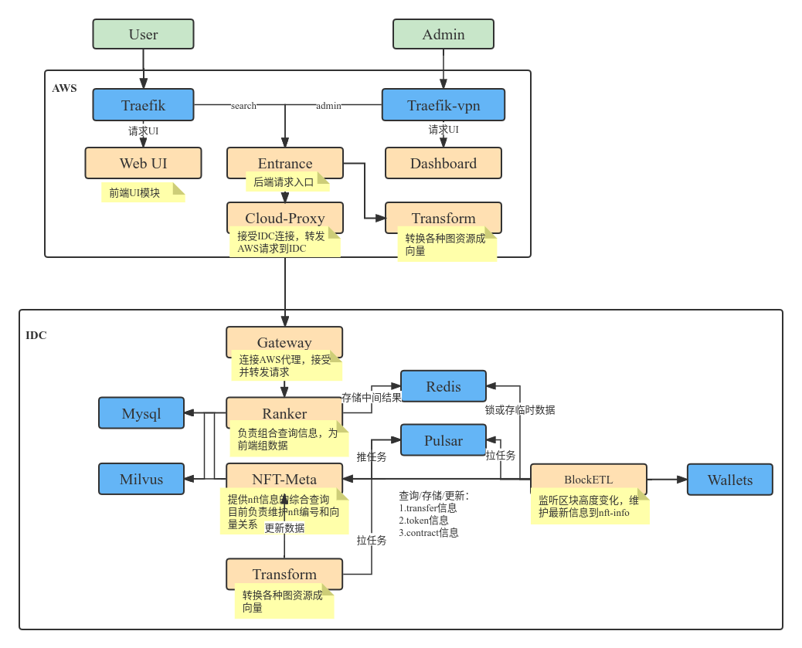
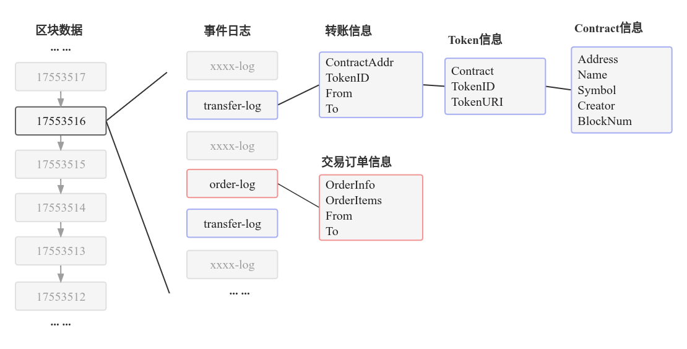
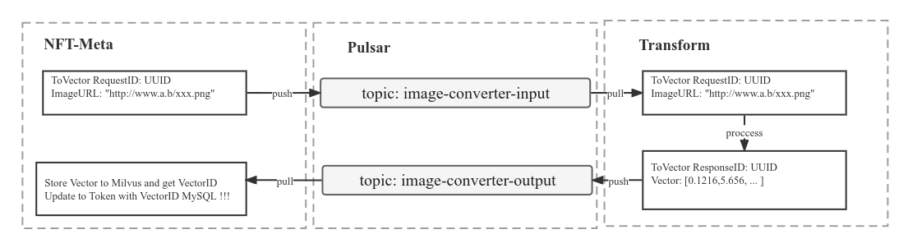

# Web3Eye

目前在NFT的世界中很多关于区块链的信息索取方法复杂且用户难以上手，让大众很难获取信息；

再者目前的各种区块链项目数据是割裂状态 ，获取或整理信息就变得更难了；

Web3Eye是一个聚合历史NFT交易记录的搜素引擎；

可以提供NFT资产的多链聚合搜索。

## 架构

中间件：  
**MySql** 存储任务信息、NFT数据关系  
**Pulsar** 主要用于任务分配  
**Redis** 用于缓存从MySql查到的热信息(计算机中的局部原理，减轻MySql的压力)  
**Milvus** 用于存储向量数据，以及提供向量搜索  
**Traefik** 提供服务路由  

微服务模块：  
**NFT-Meta** 维护区块转储任务,存储NFT交易、NFT资产、NFT对应Contract等信息  
**Block-ETL** 负责与区块链节点交互，获取NFT的transfer日志，分析对应的Token信息以及Cantract信息  
**Transform** 向量生成服务  
**Ranker** NFT-Meta项目负责组织任务以及负责对接解析好的数据，将其存入数据库，而Ranker则对接查询&搜索功能，有机组合数据  
**Gateway&Cloud-Proxy** Gateway和Cloud-Proxy是AWS和IDC之间的信息桥梁，Gateway主动连接Cloud-Proxy，向AWS提供数据服务  
**Entrance** 负责向外提供服务接口，外面的服务统一从Entrance入口进入，通过Cloud-Proxy和Gateway请求到IDC  
**WebUI** 主要负责用户侧UI  
**Dashboard** 主要负责管理员UI  

主要的模块有四个：NFT-Meta、Block-ETL、Transform、Ranker，分别负责组织NFT数据以及解析任务、从链上索引数据、提供向量服务、提供搜索服务。

按照部署位置分为：AWS、IDC两端，AWS提供用户和管理员入口，IDC负责存储数据、提供数据查询、解析链上数据。

### 主要模块设计

#### Block-ETL

目前仅支持Ethereum、Solana

从区块链全节点（存有全部区块数据，下面称为钱包节点）中的log中**拉取transfer信息，解析出NFT交易、Token、Contract信息**；由于存在Swap合约、非标准NFT合约所以部分Token信息无法解析出资产信息（比如图片描述和图片地址）。

从NFT-Meta获取的任务粒度为区块高度，从一个区块高度中获取所有的transfer-log，记录每一笔transfer；再从transfer信息查找Token信息，因为多笔transfer可能会对应到同一个Token，所以会先向数据库查询Token是否存在，不存在会向钱包节点请求TokenURI同时也会检查对应的Contract是否存在。在此处查询Token和Contract是否存在时，其实会先检查Redis里是否有记录，没有记录再去数据库查询，当查询到后会在Redis中建立一条记录。

在拉取transfer的同时会同步拉取order-log的信息，同步将订单信息解析到数据库中，在ranker查询时将有order信息的transfer一同返回到用户。

在解析一个区块的transfer日志时，大部分信息都可以从钱包节点获取。但是从TokenURI中所带的信息需要从互联网或者IPFS上获取，或者直接在区块链上存储Base64、SVG等，解析TokenURI的工作目前还属于这个模块，后续考虑独立成一个单独的模块。因为这样的解析工作费时费力，同时尽量保持Block-ETL只与钱包节点交互、只做链上数据的转存工作。

#### NFT-Meta

这个模块主要负责数据的CRUD以及向Pulsar中丢任务，提供数据的CRUD不用多说，向Pulsar中丢任务是为了解决任务之间速度不匹配的问题。

NFT-Meta主要维护的表：  
1 **Transfers**  NFT-交易记录  
2 **Tokens**  NFT-资产信息  
3 **Contracts**  NFT-合约信息  
4 **Orders**  NFT-订单信息 

分配到其他两个模块的任务都由NFT-Meta发出、存储其他两个模块处理过的数据。

向量数据主要存在Milvus中，关系型数据主要存在MySql中。Milvus与MySql中的数据依靠Milvus提供的ID关联。  

Milvus中结构为：

{  
    ID: 13125  
    Vector: [0.234,2.923,...]  
}

MySql中会关联Milvus中的ID字段  
如：  

{  
...  
    ID: 29aa144d-beb0-4d25-b7bb-95587fe06ba4  
    VectorID: 13125  
    VectorState: Success  
...  
}  

#### Transform

目前主要提供Jpg、Jepg、Png等常规图片格式的转向量操作，其他图像资源比如GIF等目前并不支持。  

服务启动后有两个线程，一个负责提供HTTP接口方式的转向量方式，提供同步的转向量方式，支持URL和文件两种方式；还有一个负责从Pulsar获取转向量任务，转换后放入Pulsar中NFT-Meta获取后存入Milvus和数据库。  

#### Ranker

Ranker只负责从数据库中查询数据，将数据组合成前端需要的结构。在Ranker中，会直接到Milvus中和MySql中进行查询，不经过NFT-Meta，但是部分接口会直接包装NFT-Meta的API函数，不重复写功能一致的函数。需要多张表联合查询的，直接实现CRUD层提供功能。涉及到搜索的部分时，为了提升速度减少重复查询，将组合好的中间结果保留主干信息后放到Redis，需要时进行填充。

### 主要流程

如何做到搜索NFT资产？已有的搜索方式都是通过合约和TokenID，Web3Eye采用的是相似度搜索。NFT资产的形式多种多样，多是以非结构化数据展示，比如图像、音频、视频等转换成向量支持搜索；目前仅支持以图搜图，后续跟进其他形式的NFT资产。

有了非结构化数据的搜索，接下来就是聚合NFT数据，从钱包节点上获取transfer日志（NFT交易的日志）分析出Token和Contract信息。与NFT相关的三个数据中，transfer和Contract信息可以较简单的获取到，而Token的解析稍微复杂些。

#### 以图搜图

以图搜图就是特征向量求距离的过程，从一堆已有的特征向量中，求出与给定特征向量的距离，取出最小距离排名的前N个即可。

已有的特征向量的来源是NFT的图片数据转换而来，放到向量数据库中的。

用于搜索的图，也需要转成向量的过程，以便于与向量数据库中的数据做距离运算。

在Web3Eye中搜索一张图，大致经历四个阶段。

1. 用户带文件请求（图片文件）发送到Entrance  
2. Entrance将请求转发给Transform转换成向量，发送到Ranker  
3. 拿到向量的Ranker去Milvus中查找相似的向量，并且返回向量ID  
4. Ranker拿到相似向量的ID，去MySql中将ID对应的Token信息查询出来  
最后返回到用户即可  

#### 获取Token信息

Token的主要字段如下：  
{  
"Contract"  
"TokenID"  
"TokenType"  
"URI"  
"ImageURL"  
"VectorID"  
}  

其中Contract、TokenID、URI都是可以直接从钱包节点获取的，而TokenType、ImageURL可以通过分析URI得到。而VectorID则需要在其他信息都获得之后，在NFT-Meta中插入一条Token记录时，将转向量的任务放到队列中，等待Transform消费，转换完成后放入结果队列等待NFT-Meta更新VectorID字段。

#### 任务分发

目前用到Pulsar的地方有两个，一是给Transform放转向量任务，二是给Block-ETL放需要解析的区块高度。

图中就是需要大量转向量对时间要求不高时的转向量任务处理过程，因为转向量时消耗网络带宽和计算资源所以采用异步的方式提高稳定性。

但是在搜索时就直接请求Transform提供的HTTP转向量方式，提高响应速度。

Block-ETL主要负责分析每一个区块高度出来的数据，并放入NFT-Meta中。

Blcok-ETL获取的任务（待同步的区块高度号），有两个过程：

1.管理员通过请求NFT-Meta建立同步任务，任务包含开始区块、结束区块、当前区块  
2.Blocke-ETL会定期检查(向NFT-Meta请求)是否有需要同步的Topic，有则监听并消费  

第一个过程很简单就是往数据库加入一条任务记录。第二个要求Block-ETL主动查询待同步的任务，主动触发NFT-Meta往Pulsar中放数据，虽然是NFT-Meta放数据，但是消费的主动权交到Block-ETL，同时让NFT-Meta更加无状态化。

## 部署文档

[k8s-deploy](doc/deploy/k8s-deploy.md)

## 性能测试

[performance-estimate](doc/deploy/performance.md)

## 版本迭代计划

[0.1.0](doc/feature/0.1.0.md)

[0.2.0](doc/feature/0.2.0.md)

[100.0.0](doc/feature/100.0.0.md)

## 仓库及文档说明

主要工程以及需求文档：

https://github.com/web3eye-io/Web3Eye/tree/master

图标、白皮书等存放：

https://github.com/web3eye-io/documents

## 参考
